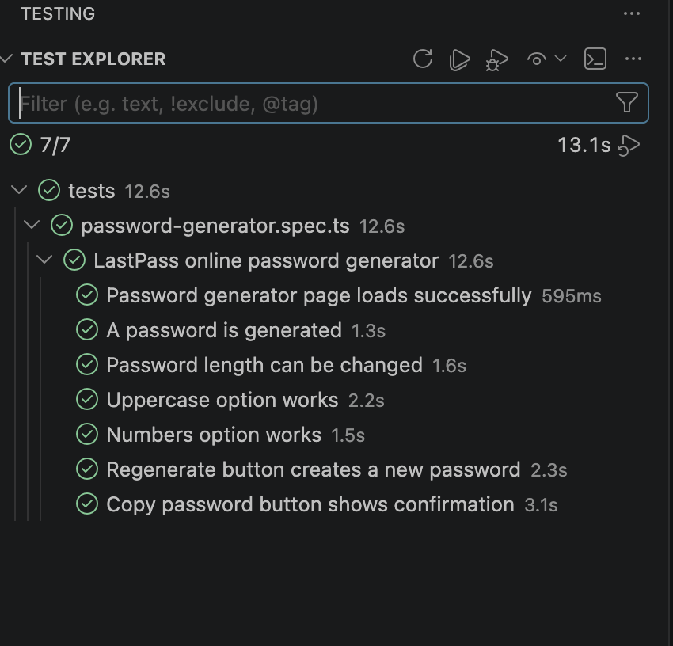

# LastPass Password Generator Automation
This repository contains a reusable Playwright + TypeScript automation framework for testing the LastPass online password generator.

Target website:

```
https://www.lastpass.com/features/password-generator#generatorTool
```

## Overview
The goal of this project is to create automated UI tests for the LastPass online password generator using Playwright.

The framework is designed to be:

- Maintainable
- Extensible
- Reusable
- Easy to run locally
- Easy to debug in VS Code

The test suite covers more than five key features of the password generator.

## Tech Stack

- Playwright
- TypeScript
- Node.js
- VS Code
- Playwright VS Code Extension

## Project Structure

```
LastPassGenerator
├── pages
│   └── PasswordGeneratorPage.ts
├── tests
│   └── password-generator.spec.ts
├── utils
│   └── passwordRules.ts
├── playwright.config.ts
├── tsconfig.json
├── package.json
├── package-lock.json
├── .gitignore
└── README.md
```

## Folder and File Description

### `pages/PasswordGeneratorPage.ts`
This file contains the Page Object Model for the LastPass password generator page.

It includes reusable page actions such as:

- Navigating to the generator page
- Handling popups or overlays
- Reading the generated password
- Changing password length
- Clicking the generate button
- Clicking the copy button
- Toggling password options

Keeping page actions in one file makes the framework easier to maintain. If a selector changes, only the page object needs to be updated.

### `tests/password-generator.spec.ts`
This file contains the automated test cases.

The tests are kept clean and readable by calling reusable methods from the Page Object instead of directly writing selectors inside the test file.

### `utils/passwordRules.ts`
This file contains reusable password validation helper methods.

Examples:

- Validate password length
- Check whether a password contains uppercase letters
- Check whether a password contains numbers
- Check whether a password contains lowercase letters
- Check whether a password contains symbols

This keeps assertion logic reusable across multiple tests.

### `playwright.config.ts`
This file contains Playwright configuration, including:

- Test directory
- Browser configuration
- Reporter configuration
- Trace settings
- Retry settings
- Parallel execution settings

### `tsconfig.json`
This file contains TypeScript configuration for the project.

It helps VS Code and TypeScript understand the project files, Playwright types, and Node.js types.

## Covered Features
The automation suite covers the following password generator features:

1. Password generator page loads successfully
2. A password is generated
3. Password length can be changed
4. Uppercase option works
5. Numbers option works
6. Generate button creates a new password
7. Copy password button shows confirmation

## Prerequisites
Before running the project, make sure the following are installed:

- Node.js
- npm
- VS Code
- Microsoft Playwright Testing extension for VS Code

You can confirm Node.js and npm are installed by running:

```
node -v
npm -v
```

## Setup Instructions

### 1. Clone the repository

```
git clone https://github.com/TanushParkashVerma/LastPassGenerator.git
cd LastPassGenerator
```

### 2. Install project dependencies

```
npm install
```

### 3. Install Playwright browsers

```
npx playwright install
```

### 4. Verify TypeScript configuration

```
npm exec -- tsc --project tsconfig.json --noEmit
```
This command checks TypeScript errors without generating any output files.

## Running Tests

### Run all tests

```
npm test
```

### Run tests in headed mode
This opens the browser while tests are running.

```
npm run test:headed
```

### Run tests using Playwright UI mode

```
npm run test:ui
```

### Run tests in debug mode

```
npm run test:debug
```

### View Playwright HTML report

```
npm run report
```

## Verified Test Results
The suite is passing locally in VS Code Test Explorer.

- 7/7 tests passed
- `tests/password-generator.spec.ts`
- `LastPass online password generator`
  - Password generator page loads successfully
  - A password is generated
  - Password length can be changed
  - Uppercase option works
  - Numbers option works
  - Regenerate button creates a new password
  - Copy password button shows confirmation

If you want to attach the screenshot you shared, save it as `screenshots/tests-passing.png` and add:

```md

```

## Running Tests from VS Code
You can also run tests directly from VS Code.

Steps:

1. Install the Microsoft Playwright Testing extension.
2. Open the project folder in VS Code.
3. Open the Testing sidebar.
4. Select the browser project you want to run.
5. Click the play button beside a test file or individual test case.

This is useful for debugging and running specific test cases quickly.

```

## Test Design Approach
This project follows the Page Object Model pattern.

The main benefits of this approach are:

- Test cases are easier to read
- Selectors are managed in one place
- Code duplication is reduced
- New tests can be added easily
- The framework is easier to maintain if the UI changes

Example:

Instead of writing page locators directly inside every test, the test calls reusable methods from `PasswordGeneratorPage.ts`.

This keeps the test file focused on test flow and assertions.

## Example Test Coverage
The test suite validates that:

- The LastPass password generator page opens successfully
- A password value is displayed
- Changing the password length updates the generated password
- Enabling uppercase letters generates a password with uppercase characters
- Enabling numbers generates a password with numeric characters
- Clicking the generate button creates a different password
- Clicking the copy button displays a copied confirmation message

## Debugging Tips
If a test fails, use headed mode:

```
npm run test:headed
```
Or use debug mode:

```
npm run test:debug
```
You can also open the Playwright report:

```
npm run report
```

The report shows:

- Passed tests
- Failed tests
- Screenshots
- Error messages
- Trace details if enabled

## Notes

- Stable selectors such as `getByRole`, `getByLabel`, and `getByText` are preferred where possible.
- The Page Object handles overlays and consent banners where needed.
- Utility functions are used to keep password validation reusable.
- Test logic is separated from page interaction logic.
- Since this is a live public website, selectors may need to be updated if the website changes.

## Files Not Included in Submission
The following files and folders should not be included in the final zip or GitHub repository:

```
node_modules/
playwright-report/
test-results/
```
These should be added to `.gitignore`.

## Recommended `.gitignore`

```
node_modules/
playwright-report/
test-results/
.env
```

## Submission

## Author
Tanush Parkash Verma
